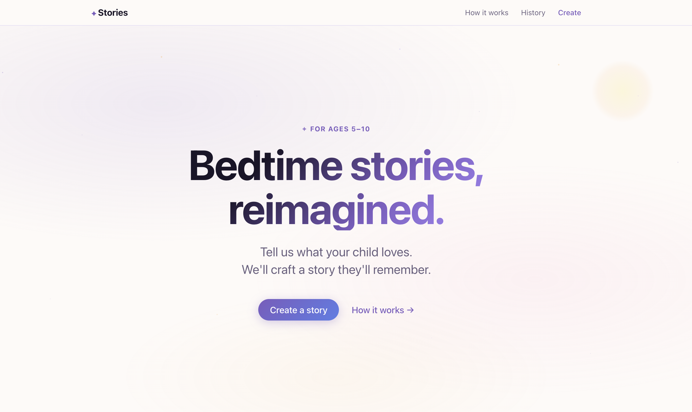
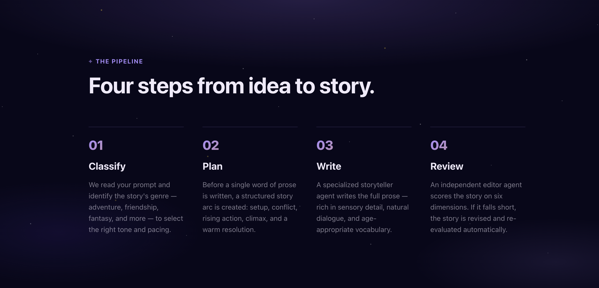
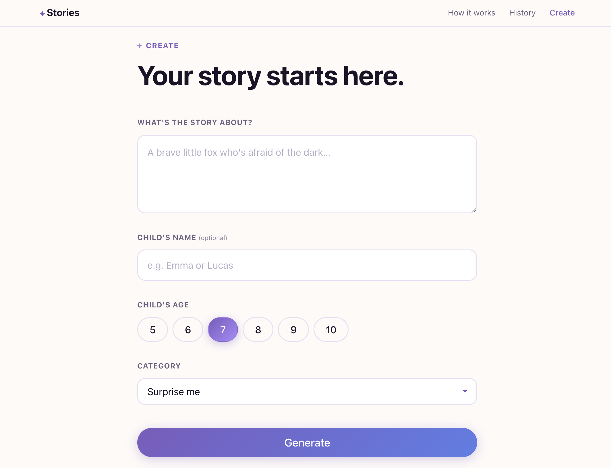
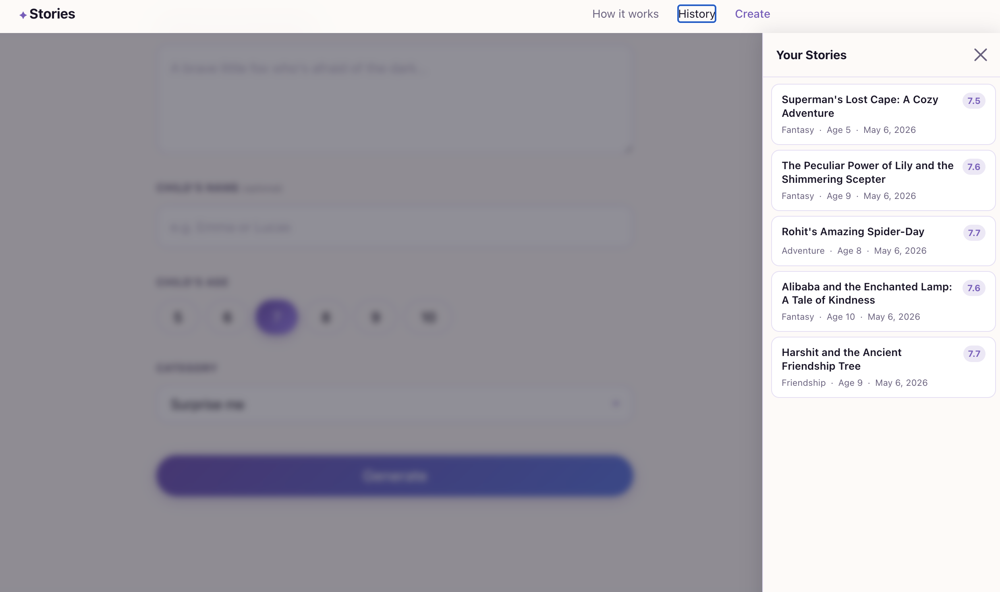
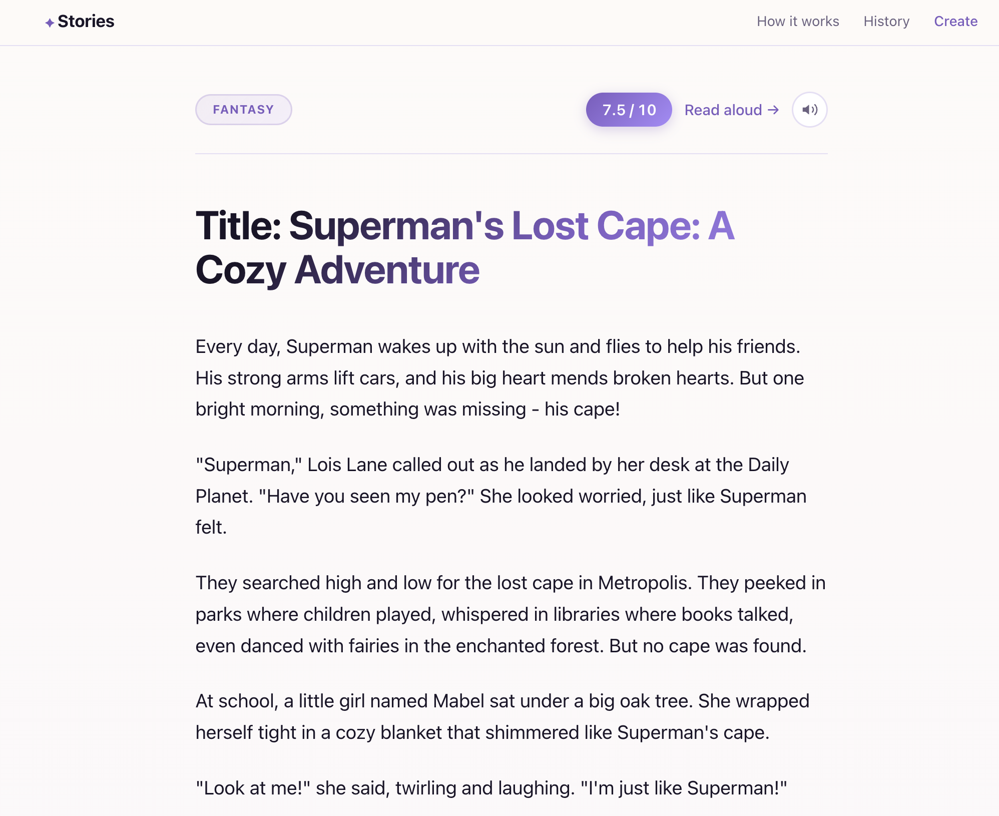
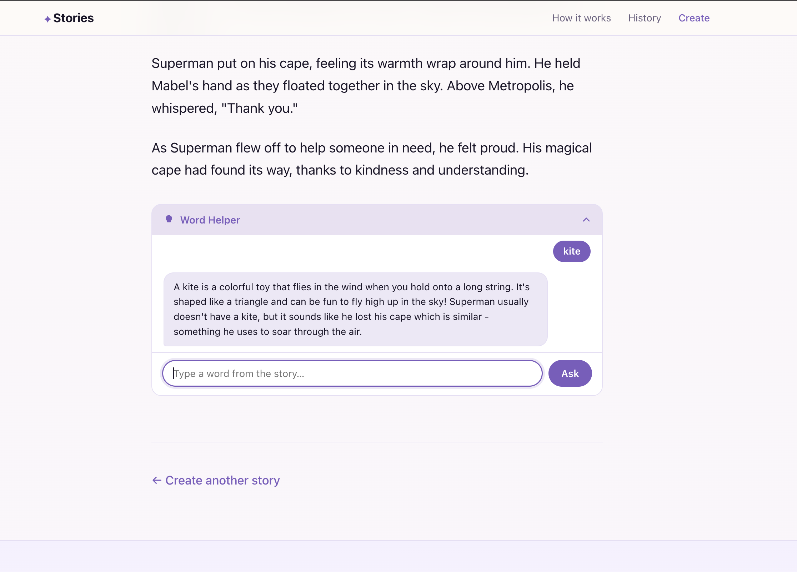
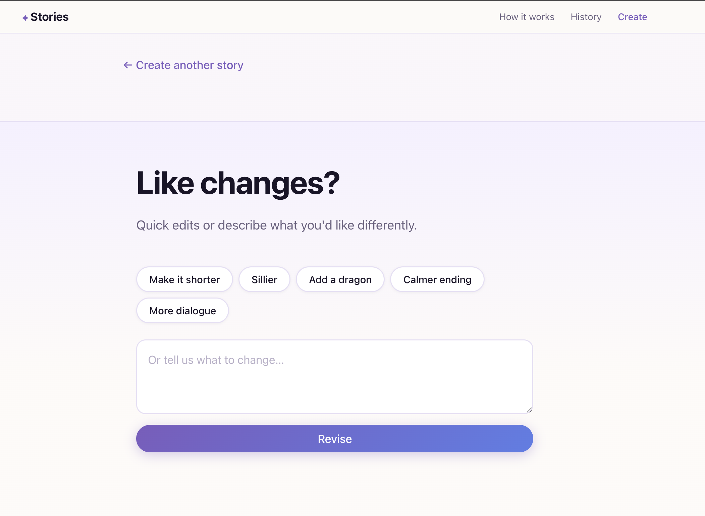
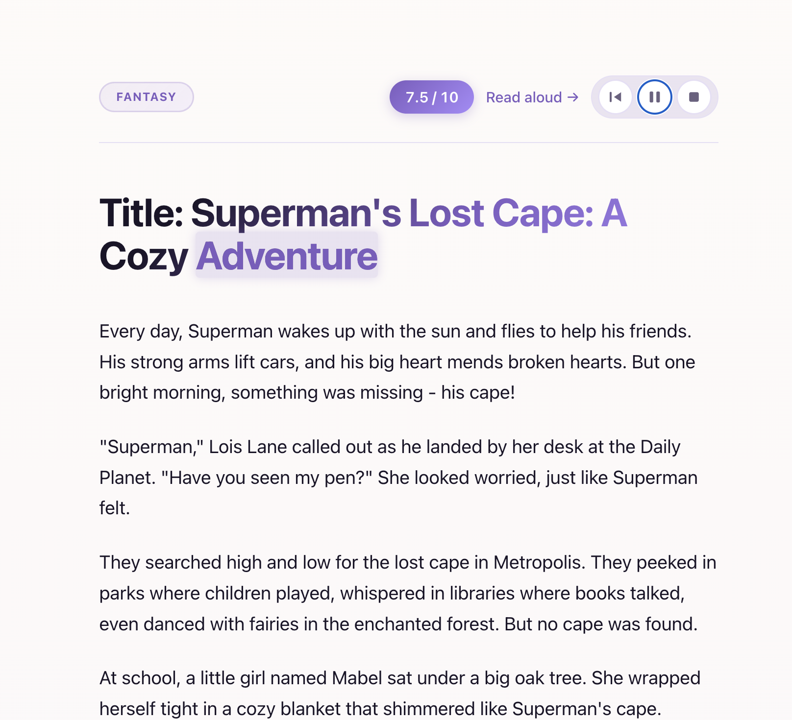

# Bedtime Story Generator

A multi-agent pipeline that turns a simple story request into a polished,
age-appropriate bedtime story for children ages 5–10. An independent LLM judge
evaluates every story against a 6-dimension rubric and drives up to two automatic
revision rounds before delivery.

---

## Screenshots

| | |
|---|---|
|  |  |
| **Landing page** | **How it works — pipeline steps** |
|  |  |
| **Story creation form** | **History panel** |
|  |  |
| **Generated story with score** | **Word Helper chatbot** |
|  |  |
| **Feedback & revision panel** | **Read-aloud TTS player** |

---

## Quick Start

### 1. Install dependencies

```bash
python -m venv venv
source venv/bin/activate       # Windows: venv\Scripts\activate
pip install -r requirements.txt
```

### 2. Set your API key

```bash
export OPENAI_API_KEY=sk-...
```
Or create a `.env` file and load it with `python-dotenv`.
**Never commit your key** — `.gitignore` excludes `.env` and `*.key`.

### 3a. Run the CLI

```bash
python story_generator.py
```

Follow the prompts: describe the story, choose the child's age, optionally
request narrator read-aloud cues.

### 3b. Run the Web UI

```bash
uvicorn web.server:app --reload
```

Open `http://localhost:8000` in your browser.

---

## Architecture Overview

```
User Input
  │
  ▼  temp=0.2
RequestClassifier ──→ category (adventure / friendship / animal_tale /
  │                             fantasy / bedtime_calm / educational)
  ▼  temp=0.5
StoryPlanner ──→ structured JSON outline (Freytag arc)
  │
  ▼  temp=0.85
Storyteller ──→ prose (600-800 words)
  │
  ▼  temp=0.2
JudgeAgent ──→ rubric scores + revision notes
  │
  ├─ PASS (overall ≥ 7.5, safety ≥ 9) ─────────→ NarratorVoice → Final Story
  │
  └─ FAIL (max 2 rounds) ──→ Storyteller.revise ──→ JudgeAgent (repeat)
                              └─ after 2 rounds: return best version
```

See `architecture.md` for the full Mermaid diagram and per-agent breakdown.

---

## Design Rationale

### Why a separate JudgeAgent instead of self-critique?

When the same model evaluates its own output in the same conversation, it is
systematically biased toward finding merit in its own choices — the equivalent
of an author copy-editing their own manuscript. The JudgeAgent uses a distinct
system prompt, a "strict children's literature editor" persona, and an explicit
calibration scale (what does a 7 vs 8 vs 9 look like?), making it genuinely
harder for the model to rationalize away real problems. This mirrors professional
editorial practice: authors and editors are different people for good reason.

The judge also uses **chain-of-thought** — it writes a `"reasoning"` field
*before* scoring — which measurably improves calibration by forcing the model to
articulate evidence before committing to a number.

### Why these six rubric dimensions and weights?

| Dimension | Weight | Rationale |
|---|---|---|
| `safety` | 25% | Non-negotiable. A child-unsafe story fails its core purpose regardless of literary quality. Hardcoded threshold: must score ≥ 9 to pass. |
| `age_appropriateness` | 20% | The most common failure mode — LLMs default to vocabulary and emotional complexity beyond 5-10 year olds. |
| `narrative_arc_quality` | 15% | Many LLM stories are "vibes" without real structure. This catches stories that meander or skip the climax. |
| `engagement` | 15% | A technically correct story that a child won't listen to has failed. This is the child's perspective. |
| `language_level` | 15% | Vocabulary + sentence rhythm specific to early readers. Distinct from age_appropriateness (theme). |
| `originality` | 10% | LLMs default to clichés. Scoring this creates pressure for fresh imagery, even if it's the least critical dimension for a good bedtime story. |

### Why these six classifier categories?

They map to the major axes of children's literature that require genuinely
different prompt strategies:

- **adventure** / **fantasy** diverge in *how magic works* — adventure resolves
  through bravery and skill, fantasy through cleverness within magical rules.
- **friendship** requires emotional vocabulary and validated feelings; the others
  don't.
- **animal_tale** needs sensory nature detail and distinct animal personalities.
- **bedtime_calm** must actively slow pacing and use repetition — opposite of
  adventure's forward momentum.
- **educational** must avoid the "as you know, Bob" exposition trap.

Six categories is small enough that `gpt-3.5-turbo` classifies reliably with
temperature 0.2 and a JSON-mode prompt.

### Why temperature 0.85 for the Storyteller, 0.2 for the Judge?

**Storyteller at 0.85**: Prose quality requires lexical diversity, unexpected
metaphors, and rhythmic variation. At temperature 0.3, the model produces
grammatically correct but repetitive, predictable text — every fox is "small and
brave," every night is "dark and quiet." At 0.85, the same model uses "the color
of a fading bruise" instead of "dark blue," which is exactly what makes children's
literature memorable. The downside (occasional incoherence) is caught by the judge.

**Judge at 0.2**: Scoring must be consistent. If you run the same story through
the judge twice, you want similar scores — otherwise the revision loop cannot
determine whether a revision actually improved the story or just rolled the dice
differently. Low temperature anchors the model to its calibration examples and
produces variance of ≤ 0.5 points across identical inputs.

### Why a maximum of two revision rounds?

1. **Diminishing returns**: The biggest improvement comes in revision 1, which
   fixes the most obvious problems. By revision 2, the model is making changes
   rather than improvements. A third round rarely closes the gap to threshold.
2. **Cost/latency**: Each round is 2-3 API calls (~4-6 seconds). Two rounds
   keeps the pipeline responsive while covering most real failure modes.
3. **Good enough is good enough**: A score of 7.0 is "solid, publishable quality"
   by the judge's own calibration. Returning the best-scoring version with a note
   is better than an infinite loop chasing a threshold.

---

## How to Extend

### Add a new story category

1. Add the category name to `agents/classifier.py` → `VALID_CATEGORIES`.
2. Add a system prompt string to `prompts/storyteller_prompts.py` → `CATEGORY_SYSTEM_PROMPTS`.
3. Update `prompts/classifier_prompts.py` to include the new category in the list.
4. Add test prompts to `evals/test_prompts.json` and re-run `python evals/run_evals.py`.

### Swap the judge model

The judge model is controlled by the `MODEL` constant in `utils/openai_client.py`.
Per assignment requirements, this is fixed at `gpt-3.5-turbo`. To use a stronger
judge (e.g., in a fork), change `MODEL` there — all agents inherit from it.

If you want a *different* model for the judge specifically, add a `JUDGE_MODEL`
constant to `utils/openai_client.py` and import it in `agents/judge.py`.

### Add a new rubric dimension

1. Add the dimension and its weight to `agents/judge.py` → `RUBRIC_WEIGHTS`
   (ensure weights still sum to 1.0).
2. Add the dimension definition to `prompts/judge_prompts.py` → `JUDGE_SYSTEM_PROMPT`.
3. Update the JSON schema in the same prompt to include the new dimension.

---

## What I'd Build Next

Given two more hours:

1. **Token-level story streaming** via the OpenAI streaming API —
   `stream=True` + yielding each `delta.content` chunk as an SSE event would
   make the writing step feel live rather than appearing all at once.

2. **Persistent child profile / story memory** — store a lightweight profile
   (child's name, favorite characters, previously told stories) in a local
   JSON file. The classifier and planner would incorporate this context, enabling
   "tell me another story about Luna the rabbit" to work seamlessly.

3. **Eval baseline comparison** — run the pipeline once with no revision loop
   (initial story only) and once with the full loop, then diff the score
   distributions. This quantifies exactly how much the judge+revision cycle
   improves quality, which is the core empirical claim of the system.

---

## Eval Results

Run `python evals/run_evals.py` to generate live results.

Expected performance on `gpt-3.5-turbo`:

| Metric | Expected |
|---|---|
| Pass rate (first try) | ~50-60% |
| Pass rate (after 2 revisions) | ~75-85% |
| Avg overall score | 7.2 – 8.0 |
| Avg safety score | 8.8 – 9.5 |
| Category classification accuracy | ~90% |

The judge is calibrated to be strict (7.5 threshold on a model where 7 = "solid,
publishable"). Failure cases are typically `narrative_arc_quality` (stories that
meander without a real climax) and `originality` (clichéd imagery).

---

## Project Structure

```
story_generator.py      CLI entry point
main.py                 Updated original skeleton (gpt-3.5-turbo, new SDK)
agents/                 One agent per file
prompts/                All prompt strings as versionable Python constants
pipeline/               RevisionLoop + UserFeedbackLoop
utils/                  OpenAI client factory + MODEL constant
web/server.py           FastAPI + SSE streaming
web/static/             index.html + styles.css + main.js (vanilla JS)
evals/                  test_prompts.json + run_evals.py
```
