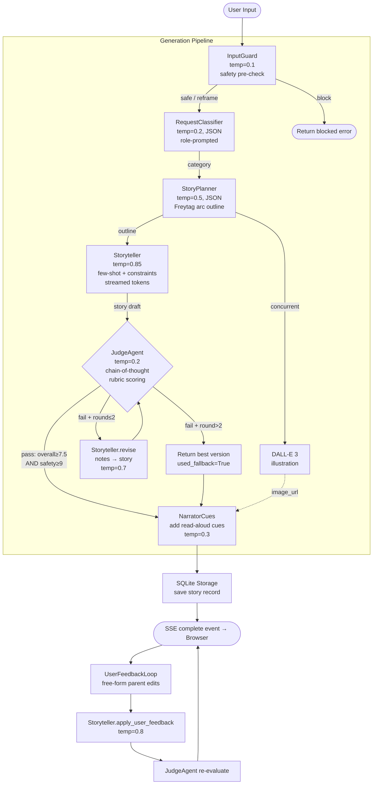

# Architecture — Bedtime Story Generator

## Overview

A multi-agent pipeline built on **OpenAI `gpt-3.5-turbo`** that transforms a simple story request into a polished, age-appropriate bedtime story for children aged 5–10. The system exposes both a CLI and a streaming web UI backed by a **FastAPI** server.

---

## High-Level Flow

```
Browser / CLI
     │
     ▼
┌─────────────────────────────────────────────────────────────┐
│                        FastAPI Server                       │
│  POST /generate  (SSE stream)   POST /revise               │
│  POST /tts       POST /vocab    GET  /history              │
└───────────────────────┬─────────────────────────────────────┘
                        │
                        ▼
             ┌──────────────────┐
             │   InputGuard     │  temp=0.1 — safety gate
             └────────┬─────────┘
           safe/reframe│  block → return error SSE
                        ▼
             ┌──────────────────┐
             │RequestClassifier │  temp=0.2 — genre detection
             └────────┬─────────┘
                        │  category
                        ▼
             ┌──────────────────┐
             │  StoryPlanner    │  temp=0.5 — Freytag arc outline (JSON)
             └────────┬─────────┘
                        │  outline dict
           ┌────────────┴──────────────┐
           │ (concurrent)              │
           ▼                           ▼
  ┌─────────────────┐       ┌───────────────────┐
  │   Storyteller   │       │  DALL-E 3 (illus) │
  │  write_stream   │       │  (background task)│
  │  temp=0.85      │       └───────────────────┘
  └────────┬────────┘
           │ story prose (streamed tokens → SSE)
           ▼
  ┌─────────────────┐
  │   JudgeAgent    │  temp=0.2 — 6-dimension rubric
  └────────┬────────┘
           │
    pass? ─┴─ fail?
      │              │
      │        ┌─────▼──────────────────────┐
      │        │  Storyteller.revise        │  temp=0.7
      │        │  (up to 2 rounds)          │
      │        └─────────────┬──────────────┘
      │                      │ re-evaluate
      │                 JudgeAgent (repeat)
      │
      ▼
  ┌─────────────────┐
  │ NarratorCues    │  temp=0.3 — adds [pause] / [whisper] markers
  └────────┬────────┘
           │
           ▼
  ┌─────────────────┐
  │  SQLite Storage │  save story + judgment + image_url
  └────────┬────────┘
           │
           ▼
  SSE "complete" event → Browser renders story
```

---

## Mermaid Flowchart



---

## Agents

| Agent | File | Temp | Purpose |
|---|---|---|---|
| `InputGuard` | `agents/input_guard.py` | 0.1 | Safety pre-check — verdicts: `safe`, `reframe`, `block` |
| `RequestClassifier` | `agents/classifier.py` | 0.2 | Maps prompt to one of 6 genres |
| `StoryPlanner` | `agents/planner.py` | 0.5 | Produces a structured Freytag-arc outline (JSON) |
| `Storyteller` | `agents/storyteller.py` | 0.85 / 0.7 / 0.3 / 0.8 | Writes, revises, adds narrator cues, applies user feedback |
| `JudgeAgent` | `agents/judge.py` | 0.2 | Scores story on 6 dimensions; drives revision loop |

---

## Pipeline Modules

### RevisionLoop (`pipeline/revision_loop.py`)
- Runs up to **2 rounds** of judge → revise cycles
- Tracks the highest-scoring version across all rounds
- Returns best version even if threshold is never met (`used_fallback: True`)
- Pass criteria: `overall_score ≥ 7.5` **AND** `safety_score ≥ 9.0`

### UserFeedbackLoop (`pipeline/feedback_loop.py`)
- Applied after story delivery when a parent requests changes
- Flow: `apply_user_feedback` → `add_narrator_cues` → `JudgeAgent.evaluate`
- Ensures quality is maintained even after post-delivery edits

---

## Judge Rubric

| Dimension | Weight | Notes |
|---|---|---|
| `safety` | 25% | Hard threshold ≥ 9.0 regardless of overall score |
| `age_appropriateness` | 20% | Most common LLM failure mode |
| `narrative_arc_quality` | 15% | Catches meandering, climax-less stories |
| `engagement` | 15% | The child's perspective |
| `language_level` | 15% | Vocabulary + sentence rhythm for early readers |
| `originality` | 10% | Pressure against clichéd imagery |

---

## Prompting Techniques

| Technique | Where used |
|---|---|
| Role prompting | All agents — each has a distinct expert persona |
| Structured output (JSON mode) | InputGuard, Classifier, Planner, Judge |
| Chain-of-thought | Judge — `"reasoning"` field written before scoring |
| Few-shot examples | Storyteller — `animal_tale` and `bedtime_calm` prompts embed full prose samples |
| Constraint stacking | Storyteller — explicit word count, paragraph count, DO/DO NOT lists |
| Outline-first chain | Planner → Storyteller — structure separated from prose generation |
| Independent judge | JudgeAgent uses a separate "strict editor" persona to avoid self-critique bias |
| Temperature tuning | High (0.85) for prose creativity, low (0.2) for consistent scoring |

---

## Story Categories

`adventure` · `friendship` · `animal_tale` · `fantasy` · `bedtime_calm` · `educational`

Each category uses a distinct system prompt persona in `prompts/storyteller_prompts.py`. The classifier defaults to `adventure` on parse errors.

---

## Web API Endpoints

| Method | Path | Description |
|---|---|---|
| `GET` | `/` | Serves `index.html` |
| `POST` | `/generate` | SSE stream — full pipeline, token-by-token story output |
| `POST` | `/revise` | Applies parent feedback, returns revised story JSON |
| `GET` | `/history` | Last 50 stories (no full text) |
| `GET` | `/history/{id}` | Full story record by ID |
| `POST` | `/tts` | Edge TTS synthesis → `{ audio_b64, word_timings }` |
| `POST` | `/vocabulary` | Kid-friendly word explanation for the Word Helper |

---

## SSE Event Sequence (`POST /generate`)

```
guard      → start / complete / blocked
classify   → start / complete
plan       → start / complete
write      → start / token (×N) / complete
judge      → start / complete
revise     → start  (if needed, up to 2×)
complete   → complete  { story, narrator_story, judgment, image_url, story_id, … }
error      → error     { message }
```

---

## Utilities

| Module | Purpose |
|---|---|
| `utils/openai_client.py` | OpenAI + AsyncOpenAI client factory, `MODEL = gpt-3.5-turbo`, DALL-E 3 illustration helper |
| `utils/tts.py` | Microsoft Edge Neural TTS (`en-US-JennyNeural`), multi-segment synthesis with `[pause]` / `[whisper]` cue support, word-level timing data |
| `utils/storage.py` | SQLite persistence — save and retrieve story records |
| `utils/vocabulary.py` | Word Helper — explains story words in child-appropriate language |

---

## External Services

| Service | Used for | Auth |
|---|---|---|
| OpenAI Chat API (`gpt-3.5-turbo`) | All 5 agents | `OPENAI_API_KEY` |
| OpenAI Images API (`dall-e-3`) | Story illustration (1024×1024) | Same key |
| Microsoft Edge TTS (free) | Audio narration with word-timing sync | None |

---

## Project Structure

```
story_generator.py        CLI entry point
main.py                   Original skeleton (updated to new SDK)
agents/
  input_guard.py          Safety pre-check agent
  classifier.py           Genre classifier agent
  planner.py              Story outline agent
  storyteller.py          Prose writer agent
  judge.py                Quality evaluation agent
pipeline/
  revision_loop.py        Auto judge→revise loop (max 2 rounds)
  feedback_loop.py        Post-delivery parent feedback loop
prompts/
  age_profiles.py         Per-age vocabulary/complexity guidance
  classifier_prompts.py
  guard_prompts.py
  judge_prompts.py
  planner_prompts.py
  storyteller_prompts.py
utils/
  openai_client.py        Client factory + model constant
  tts.py                  Edge TTS synthesis
  storage.py              SQLite story persistence
  vocabulary.py           Word Helper
web/
  server.py               FastAPI + SSE streaming server
  static/
    index.html            Single-page UI
    main.js               Vanilla JS — SSE client, TTS player, history panel
    styles.css            Styles
evals/
  run_evals.py            Batch eval runner
  test_prompts.json       Evaluation prompt suite
```
