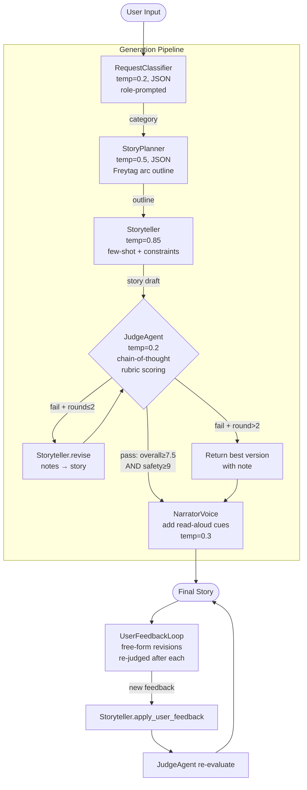

# Architecture — Bedtime Story Generator

## ASCII Block Diagram

```
 User Input (CLI or Web UI)
         │
         ▼
 ┌───────────────────┐
 │  RequestClassifier │  temp=0.2  JSON mode
 │  (role prompting)  │  → "adventure" | "friendship" |
 └─────────┬─────────┘    "animal_tale" | "fantasy" |
           │ category      "bedtime_calm" | "educational"
           ▼
 ┌───────────────────┐
 │   StoryPlanner    │  temp=0.5  JSON mode
 │  (Freytag arc)    │  → structured outline:
 └─────────┬─────────┘    title, characters, setup,
           │ outline       inciting_incident, rising_action,
           │               climax, resolution, moral
           ▼
 ┌───────────────────────────────────────────┐
 │              Storyteller                  │  temp=0.85
 │  category system prompt + few-shot       │  constraint stacking
 │  examples + STORYTELLER_BASE_RULES       │
 └─────────────────┬─────────────────────────┘
                   │ story draft
                   ▼
 ┌───────────────────────────────────────────┐
 │              JudgeAgent                   │  temp=0.2
 │  chain-of-thought → rubric scoring       │  JSON mode
 │                                           │
 │  Dimensions (weighted):                  │
 │    safety              25%               │
 │    age_appropriateness 20%               │
 │    narrative_arc        15%              │
 │    engagement           15%              │
 │    language_level       15%              │
 │    originality          10%              │
 └──────────┬────────────────────────────────┘
            │
    overall ≥ 7.5                        overall < 7.5
    AND safety ≥ 9?                      AND round ≤ 2?
            │                                   │
           YES                                 NO → return best version
            │                                   │
            │                         ┌─────────┘
            │                         ▼
            │              Storyteller.revise(story, notes)
            │                  → back to JudgeAgent
            │
            ▼
 ┌───────────────────┐
 │  NarratorVoice    │  temp=0.3
 │  add_narrator_cues│  → [pause] [whisper] [pause long]
 └─────────┬─────────┘    read-aloud performance cues
           │
           ▼
      Final Story
           │
           ▼
 ┌───────────────────┐
 │  UserFeedbackLoop │  user types free-form feedback
 │                   │  → Storyteller.apply_user_feedback
 │                   │  → JudgeAgent re-evaluate
 └───────────────────┘
```

## Mermaid Flowchart



## Agent Responsibilities

| Agent | Input | Output | Temp | Why |
|---|---|---|---|---|
| RequestClassifier | Raw user prompt | `{category, reasoning}` | 0.2 | Classification must be deterministic |
| StoryPlanner | Prompt + category | JSON outline (Freytag arc) | 0.5 | Creative but must produce reliable schema |
| Storyteller | Outline + category prompt | Prose (600-800 words) | 0.85 | Needs lexical variety and fresh imagery |
| JudgeAgent | Story + original prompt | Scores + revision notes | 0.2 | Scores must be consistent across runs |
| NarratorVoice | Story prose | Story with `[pause]`/`[whisper]` cues | 0.3 | Cue placement should be deliberate, not random |

## Prompting Techniques by Agent

| Technique | Where used |
|---|---|
| Role prompting | All agents — each has a distinct expert persona |
| Structured output (JSON mode) | Classifier, Planner, Judge |
| Chain-of-thought | Judge — `"reasoning"` field written before scoring |
| Few-shot examples | Storyteller — `animal_tale` and `bedtime_calm` prompts embed full prose samples |
| Constraint stacking | Storyteller — explicit word count, paragraph count, DO/DO NOT lists |
| Outline-first chain | Planner → Storyteller — structure separated from prose |
| Self-consistency via external judge | Revision loop — judge acts as independent verifier |
| Temperature tuning | High (0.85) for creativity, low (0.2) for consistency |

## Web Architecture

```
Browser (vanilla JS)
    │
    │  POST /generate  →  SSE stream of events
    │  POST /revise    →  JSON response
    │
    ▼
FastAPI (web/server.py)
    │  asyncio.to_thread() wraps all synchronous OpenAI calls
    │  StreamingResponse with text/event-stream media type
    │
    ▼
Agent Pipeline (same modules as CLI)
    │
    ▼
OpenAI API (gpt-3.5-turbo)
```

## File Structure

```
├── story_generator.py          CLI entry point
├── main.py                     Original skeleton (updated SDK, model unchanged)
├── agents/
│   ├── classifier.py           RequestClassifier
│   ├── planner.py              StoryPlanner
│   ├── storyteller.py          Storyteller + narrator cues + user feedback
│   └── judge.py                JudgeAgent with weighted rubric
├── pipeline/
│   ├── revision_loop.py        RevisionLoop (max 2 rounds)
│   └── feedback_loop.py        UserFeedbackLoop
├── prompts/
│   ├── classifier_prompts.py
│   ├── planner_prompts.py
│   ├── storyteller_prompts.py  (includes few-shot examples)
│   └── judge_prompts.py
├── utils/
│   └── openai_client.py        Client factory + MODEL constant
├── web/
│   ├── server.py               FastAPI + SSE
│   └── static/
│       ├── index.html          Apple-inspired UI
│       ├── styles.css          Design system (tokens, layout, components)
│       └── main.js             State management, SSE reader, animations
├── evals/
│   ├── test_prompts.json       10 test cases across all 6 categories
│   └── run_evals.py            Eval runner with summary table
├── requirements.txt
└── .gitignore
```
